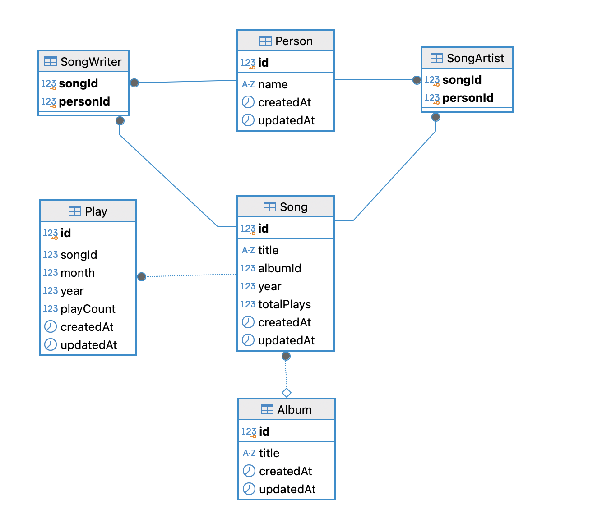
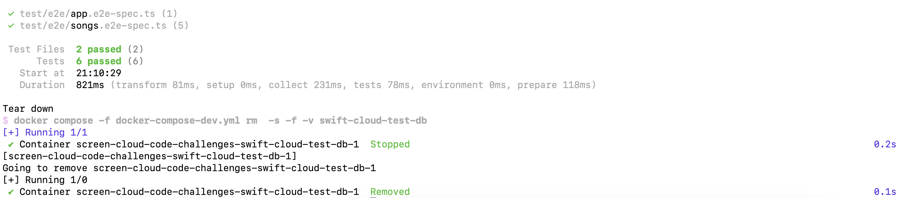

# Backend Challenge (SwiftCloud)
This repository presents a solution to the SwiftCloud coding challenge, assigned as part of the ScreenCloud test interview process. The solution is implemented using NestJs with Typescript.

## Table of Contents
- [Project Overview](#project-overview)
  - [Analysis](#analysis)
  - [Design](#design)
  - [Implementation](#implementation)
  - [Testing](#testing)
  - [Delivery](#delivery)
- [API documentation](#api-documentation)
- [Idea of future features](#idea-of-future-features)
- [Setup and Configuration](#setup-and-configuration)
  - [Environment](#environment)
  - [Run the demo](#run-the-demo)
    - [Option 1 Run the service with Docker](#option-1-run-the-service-with-docker)
    - [Option 1.1 Run the service directly with Docker](#option-11-run-the-service-directly-with-docker)
    - [Option 2 Run the service directly on local machine](#option-2-run-the-service-directly-on-local-machine)
  - [Project setup and scripts for development](#project-setup-and-scripts-for-development)
    - [Environment setup](#environment-setup)
    - [Project setup](#project-setup)
    - [Compile and run the project](#compile-and-run-the-project)
    - [Run tests](#run-tests)
      - [Unit test](#unit-test)
      - [E2E test](#e2e-test)
    - [Start local postgres database in Docker](#start-local-postgres-database-in-docker)
    - [Prisma migration](#prisma-migration)
    - [Dev scripts](#dev-scripts)
    - [Create module, controller and provider](#create-module-controller-and-provider)

# Project Overview

## Analysis
The goal of this API is to provide a flexible way to expose song data in various formats, allowing for flexible querying and sorting. The API will serve the following use cases
### 1. **List All Songs with Pagination**  
Users can also list all songs with pagination.  
  **Example**:  
  `GET /songs`

### 2. **Search Songs by Keyword**  
Users can search for songs using a keyword, which will be matched against song name, album name, writers, and artists.  
  **Example**:  
  `GET /songs?keyword=Taylor&orderBy=totalPlays&orderDirection=asc&page=1&limit=10`

### 3. **Find Songs by Year**  
The API can be used to find songs released in a specific year, with options for sorting and pagination.
  **Example**:  
  `GET /songs?year=2024&orderBy=totalPlays&orderDirection=desc&page=1&limit=10`

### 4. **Find Songs by Keyword and Year**  
The user may want to find which songs that featuring with Ed Sheeran in 2024
  **Example**:  
  `GET /songs?year=2024&keyword=Ed Sheeran`

### 5. **Include Play Data Statistics**  
The API can include play data statistics by adding the `includePlayData=true` query parameter.  
  **Example**:  
  `GET /songs?keyword=love&includePlayData=true`

### Each parameter showcases a specific capability of the API:
- year: To demonstrate the ability to filter results by a single field in the database.
- keyword: To demonstrate the api can perform searches across multiple columns in different tables.
- includePlayData: To demonstrate that the api can provide data with different shape
- page and limit: To demonstrate that the api can handle large datasets by splitting results into smaller and managable size.
- orderBy and orderDirection: To demonstrate the ability to sort results based on specified fields

<br>

## Design
Import the data as csv and fully migrated to database for query performance


<br>

### Note

- export data as csv from https://docs.google.com/spreadsheets/d/1BFT5RlMKw1blz10bUrsVuWI6FGjzsT72KHE-jRiSXFk/edit?gid=619956793#gid=619956793

- Name of artists and writers - store as one field as some names are unclear which one is first name or last name such as Shellback or Robert Ellis Orrall or St. Vincent

- One song can be only in one album; Taylor does not the same song across multiple albums.

- Introduce a new column, Total Play - represent the numbers of song has been played. This field will be updated whenever a song is played.

<br>

## Implementation
The chosen technologies are
- Bun for javascript runtime and package management
- NestJS for building scalable and maintainable server-side applications.
- Zod library for object validation
- Postgres for database
- Prisma for database ORM, data migration and seeding
- Docker for development and delivery

<br>

## Testing
- Unit test - Use unit tests with mocks to test individual components.


- Integration and E2E test - For integration and end-to-end tests, a test database is created in Docker. The service is started, and actual API endpoints are tested against the test database. After the tests, the test database is destroyed during the teardown process



<br>

## Delivery
Docker is used to build and package the application.
For demo purposes, a `docker-compose-demo.yml` file is provided. This file is used to set up the environment, including building the application, creating the database, and migrating the data.
[Step to run the demo](#run-the-demo)
<br>


<br>

## API Documentations
The api document is provided with Swagger. To access the api-docs, visit the link http://localhost:8001/api-docs.

<br>

## Idea of future features

- **Song Information**: Include more data such as image covers, genre, lyrics, song duration and more detailed about the songs.

- **Search Improvement**: Enable users to view the top songs filtered by a specific month and year.

- **Authentication and Role-Based Access**: Implement role-based authentication for secure access to APIs. Only authorized users are allowed to perform actions like adding, updating, or deleting songs, artists, writers, or other related information.

- **Play Count**: Currently, the play counts are for the current year. It could be enhanced to store more. Also add a feature to maintain this information.

- **Integrated Play Count Tracking**: Maintain the total play counts when the songs are played on platforms such as YouTube, Spotify, Apple Music, and etc.

- **Data Management**: Abilities to add new songs or updte data such as songs including totalPlays for each songs and play count in each month.

- **Recommendation System**: Develop a recommendation engine for songs and albums using diverse data sources such as current trends, popular tracks, user preferences playlist, and habbits, Studio-promoted / advertised songs and albums. 

- **Feedback Analysis**: Pull feedback and comments related to the songs and then summarize it to provide Taylor Swift insights.

- **Concert and Tour Optimization**: Report for Taylor Swift and her staffs about the fan's feedback for her concerts and tours preparation.

- **More...** 

<br><br>

# Setup and Configuration 

## Environment
1. Node - v22.12.0
2. Bun - Support typescript and environment file natively
  ```bash
  # install bun
  $ npm install -g bun
  ```
3. Docker
4. Postgress database

<br>

## Run the demo

```Prepare the environment file by create .env file and copy the content in .env.example to .env file. You can see the database connection details such as username, password, port and host ```

### Option 1 Run the service with Docker
This option is to start all the neccssary service such as database and service.
It also provide sample data in the database.

1. Run the command to start the service
```bash
$ docker compose -f "docker-compose-demo.yml" up -d --build 
```
2. Check the service starts successfully
```bash
$ docker ps
```
You should see the information below
| CONTAINER ID | IMAGE                  | COMMAND                   | CREATED         | STATUS        | PORTS                                | NAMES                 |
|--------------|------------------------|---------------------------|-----------------|--------------|--------------------------------------|-----------------------|
| ebe7c9551b9d | swift-backend:latest   | `/usr/local/bin/dock…`    | 13 minutes ago | Up 13 minutes| 0.0.0.0:8001->8001/tcp              | swift-backend         |
| 4166612fdca1 | postgres:latest        | `docker-entrypoint.s…`    | 13 minutes ago | Up 13 minutes| 5432/tcp, 0.0.0.0:5434->5434/tcp    | swift-cloud-demo-db   |

<br/>

### Option 1.1 Run the service directly with Docker
This option is to start all the neccssary service such as database and service.
It also provide sample data in the database.

1. Run the command to start the service
```bash
$ bun start:demo 
```

<br />

### Option 2 Run the service directly on local machine
In case Docker is not available, it is still possible to everything on local machine.

1. Ensure that you have a database setup and configure the .env file to connect to the database
2. Run schema migration to create the database and import data for demo
```bash
$ bun prisma:dev:deploy 
```
3. Start the service
```bash
$ bun start:prod
```
<br>

## Project setup and scripts for development

1. #### Environment setup
- Refer to .env.example

2. #### Project setup

```bash
$ bun install
```

3. #### Compile and run the project
```bash
# development
$ bun run start

# watch mode
$ bun run start:dev

# production mode
$ bun run start:prod

# demo mode - For demo purpose; start up db and run db seed
$ bun run start:demo
``` 

4. #### Run tests

  - 4.1 Unit test

    ```bash
    # unit tests
    $ bun test:unit

  - 4.2 E2E test.

    To simulate real-world conditions, end-to-end tests starts the service only once. 

    Coverage reports cannot be generated for end-to-end tests because the service runs as a web service. API calls are made during testing, preventing the coverage tool from detecting the executed code.

    ```bash
    # Reset E2E test database, start the e2e test and remove the test-db after finishing the tests
    $ bun test:e2e-full

    # Run only integration test. Use this when the test-db is alreay running
    $ bun test:e2e

    # Manually reset E2E test database 
    $ db:test:reset

    # e2e tests
    $ bun test:e2e
    ```

5. #### Start local postgres database in Docker
```bash
# First time initialization
$ docker compose -f docker-compose-dev.yml up dev-db -d

# Remove the container
$ docker compose -f docker-compose-dev.yml down

# Start container
$ docker compose -f docker-compose-dev.yml start

# Stop container
$ docker compose -f docker-compose-dev.yml stop

# Stop with specific service
$ docker compose -f docker-compose-dev.yml stop myservicename

# Remove the specific service
$ docker compose -f docker-compose-dev.yml rm -f myservicename

```

6. #### Prisma migration
```bash
# list all options
$ npx prisma

# migration manual
$ npx prisma migrate --help

# Run dev migration from changes in Prisma schema, apply it to the database
# trigger generators (e.g. Prisma Client)
$ npx prisma migrate dev

# Deploy the pending migrations to the database
$ npx prisma migrate deploy

# Push the Prisma schema state to the database
$ prisma db push
```

7. #### Dev scripts
```bash
# Manually migrate schema and apply seeding data
$ bun prisma:dev:deploy

# Remove the dev database, then re-create a new dev database and apply prisma migration script with seeding data
# CAUTION! All the data will be lost.
$ bun db:dev:reset

```

8. #### Create module, controller and provider
```bash
# Create module
$ nest g module module_name

# Create controller
$ nest g controller controller_name

# Create provider
$ nest g module provider_name

# Create resource that will automatically add module, controller and provider
$ nest g resource resource_name

```